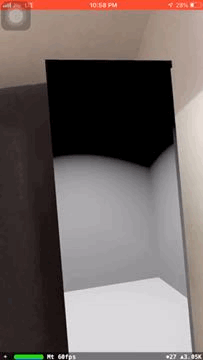

# Reality Escaper

## Introduction
> Reality Escaper is an Augmented Reality app made using Apple's ARKit. It is a fun portal to escape from the reality (Pun intended!). 

## Things To Have
**[Xcode](https://developer.apple.com/xcode/)**

### Libraries/Frameworks used and their documentation

- UIKit [Docs](https://developer.apple.com/documentation/uikit/)
- ARKit [Docs](https://developer.apple.com/documentation/arkit)

## Development Setup

Before you begin, you should already have the Xcode downloaded and set up correctly. You can find a guide on how to do this here: [Setting up Xcode](https://developer.apple.com/library/content/documentation/IDEs/Conceptual/AppStoreDistributionTutorial/Setup/Setup.html)

## Setting up the iOS Project

1. Download the _reality-escaper_ project source. You can do this either by forking and cloning the repository (recommended if you plan on pushing changes) or by downloading it as a ZIP file and extracting it.

2. Open 'reality_escaper.xcodeproj' from the folder.

3. Build the project (⌘+B) and check for any errors.

4. Run the app (⌘+R) and test it.

## Acknowledgments

* Inspired by [Jared Davidson](https://github.com/Archetapp)
* All rights reserved 

